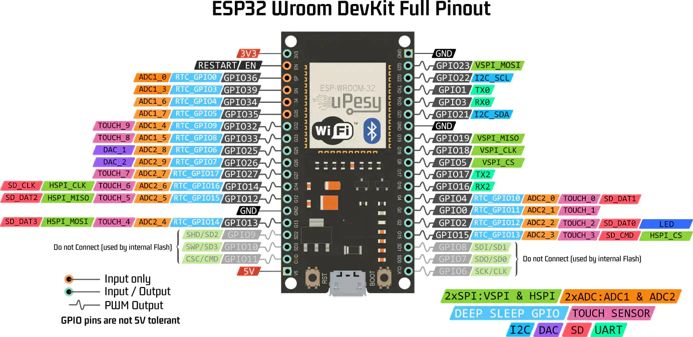

## **Overview**

This prototype consists of :
- **ESP32-VROOM** (microcontroller with Bluetooth/BLE capabilities)
- **LIS3MDL** (accelerometer for motion detection)
- **Raspberry Pi 4** (central processing unit)

**Objective**: Establish a Bluetooth connection between the ESP32 and Raspberry Pi 4 to transmit accelerometer data.

## **Hardware Components**
### **1. ESP32-VROOM**
`ESP32-VROOM` :

- **Role**: Collects motion data from the LIS3MDL sensor.
- **Wireless Connectivity**: Bluetooth/BLE for communication with the Raspberry Pi.

### **2. Raspberry Pi 4**
`Raspberry Pi4` :

- **Role**: Receives and processes data from the ESP32.

# ## **Bluetooth Connection (Primary Challenge)**
#### **1. Bind ESP32 to Raspberry Pi via RFCOMM**
Run the following command in the Raspberry Pi terminal to bind the ESP32’s MAC address to a serial port (`rfcomm0`):

```cmd
sudo rfcomm bind /dev/rfcomm0 14:2B:2F:DA:00 #MACADDRESS
```
#### **2. Scan & Pair Using `bluetoothctl`**
```bash
bluetoothctl
```
Then execute :
```bash
scan on
```

```bash
pair 14:2B:2F:DA:00 #MACADDRESS
```
#### **3. Verify Connection**

Check if the binding worked:

```bash
ls /dev/rfcomm0  # Should return the device file
```

## **Wired Connection Protocol (Sensor to ESP32)**

### **Connection Setup**

For simplicity, we used the **Grove I2C** interface of the accelerometer sensor.

**Components** :
- **LIS3MDL Accelerometer** (Grove I2C connector)
- **ESP32-VROOM** (I2C pins)


### **Wiring Diagram :**

| **Sensor Cable** | **ESP32 Pin**       |
| ---------------- | ------------------- |
| Black (GND)      | `GND`               |
| Red (VCC)        | `3V3`               |
| Yellow (SDA)     | `GPIO 21` (I2C_SDA) |
| Blue (SCL)       | `GPIO 22` (I2C_SCL) |



# ## **Python Code Implementation (Raspberry Pi 4)**

_Verifying accelerometer data transmission from ESP32 via Bluetooth_

Once the Bluetooth connection is established with the ESP32, we will verify that the X, Y, and Z coordinates are being transmitted from the accelerometer to the Raspberry Pi4.
To do this, we use Python code with the `Thonny` IDE. 

`test.py` :

```python
import smbus  
import time  
import bluetooth  
MPU6050_ADDR = 0x68  
bus = smbus.SMBus(1)  
  
  
bus.write_byte_data(MPU6050_ADDR, 0x6B, 0)  
  
  
def read_word(register):  
    high = bus.read_byte_data(MPU6050_ADDR, register)  
    low = bus.read_byte_data(MPU6050_ADDR, register + 1)  
    value = (high << 8) + low  
  
    if value >= 0x8000:  
        value -= 0x10000  
    return value  
  
  
def read_accel():  
    accel_x = read_word(0x3B)    
    accel_y = read_word(0x3D)  
    accel_z = read_word(0x3F)    
    return accel_x, accel_y, accel_z  
  
  
while True:  
    accel_data = read_accel()  
    print(f"Accéléromètre: X={accel_data[0]}, Y={accel_data[1]}, Z={accel_data[2]}")  
    time.sleep(0.1)    
    def send_data_and_display():  
        # Adresse Bluetooth de la Raspberry Pi 1 (remplacez par l'adresse MAC correcte)  
        server_address = "DC:A6:32:A8:1F:58"  
        port = 1  
  
        # Connexion Bluetooth  
        while True:  
            try:  
                client_socket = bluetooth.BluetoothSocket(bluetooth.RFCOMM)  
                client_socket.connect((server_address, port))  
                print("Connecté au récepteur Bluetooth.")  
                break  
            except bluetooth.BluetoothError as e:  
                print(f"Erreur Bluetooth : {e}")  
                client_socket = None  
  
        try:  
            while True:  
                # Lire les données de l'accéléromètre  
                 
                message = "g,djt:;k!:r:f;ute;e"  
  
                # Afficher les données localement sur la Raspberry Pi 2  
                print(f"Données locales : {message}")  
  
                # Si la connexion Bluetooth est active, envoyer les données  
                if client_socket:  
                    try:  
                        client_socket.send(message)  
                        print(f"Données envoyées via Bluetooth : {message}")  
                    except bluetooth.BluetoothError as e:  
                        print(f"Erreur d'envoi Bluetooth : {e}")  
  
                # Pause entre deux lectures  
                time.sleep(1)  
        except KeyboardInterrupt:  
            print("Programme interrompu.")  
        finally:  
            # Fermer la connexion Bluetooth si elle est ouverte  
            if client_socket:  
                client_socket.close()  
    print("zgthjzgn")  
    send_data_and_display()
```

Un fois que ce code fonctionne est que l'on à pas de problème, nous avons un deuxième code qui permet de voir toutes les data brut reçu par notre accéléromètre.

`Visualisation_DATA_BRUT.py` :

```python
import serial  
import time  
import numpy as np  
from termcolor import colored  # (pip install termcolor)  
  
# Configuration du port série  
port = '/dev/rfcomm0'  
baudrate = 9600  
ser = serial.Serial(port, baudrate, timeout=1)  
time.sleep(2)  # Attente pour la stabilisation de la connexion  
  
# Définition des seuils et de l'hystérésis  
seuil_bas = -8.8  
seuil_haut = -8.6  
zone_hystereses = 0.1  # Zone d'hystérésis pour éviter les répétitions multiples  
  
mouvement_vers_haut = False  
repetitions = 0  
valeurs_y = []  # Liste pour enregistrer les valeurs de l'axe Y  
amplitudes = []  # Amplitudes des répétitions  
start_time = time.time()  
  
# Variables pour gérer les séries  
serie_en_cours = False  
compteur_series = 0  
delai_sans_repetition = 10  # Délai (en secondes) sans détection de répétition pour considérer la fin de la série  
fenetre_dinactivite = 5  # Fenêtre de temps (en secondes) après une série pour détecter l'inactivité prolongée  
  
# Fonction pour calculer l'intensité du mouvement  
def calculer_intensite(valeurs):  
    return np.std(valeurs) if len(valeurs) > 0 else 0  
  
def afficher_stats():  
    """Affiche les statistiques en couleur"""  
    print(colored("\n--- Statistiques de la série ---", 'cyan'))  
    print(colored(f" Répétitions totales : {repetitions}", 'green'))  
     
    if amplitudes:  # Vérifier si la liste d'amplitudes n'est pas vide  
        print(colored(f" Amplitude moyenne : {np.mean(amplitudes):.2f}", 'yellow'))  
        print(colored(f" Variance des amplitudes : {np.var(amplitudes):.2f}", 'red'))  
    else:  
        print(colored(" Amplitude moyenne : Pas de données", 'yellow'))  
  
    if valeurs_y:  # Vérifier si la liste des valeurs Y n'est pas vide  
        intensite = np.std(valeurs_y)  
        asymetrie = np.mean(np.abs(valeurs_y))  
        print(colored(f" Intensité (écart-type) : {intensite:.2f}", 'magenta'))  
        print(colored(f" Asymétrie (moyenne des abs) : {asymetrie:.2f}", 'blue'))  
    else:  
        print(colored(" Intensité et Asymétrie : Pas de données", 'magenta'))  
  
try:  
    while True:  
        if ser.in_waiting > 0:  
            data = ser.readline().decode().strip()  
  
            if "Accel" in data:  
                try:  
                    # Extraction de la valeur Y  
                    y_value = float(data.split("Y:")[1].split("Z:")[0].strip())  
                    valeurs_y.append(y_value)  
  
                    # Détection du mouvement (ajout de l'hystérésis pour éviter les répétitions multiples)  
                    if y_value < seuil_bas and not mouvement_vers_haut:  
                        mouvement_vers_haut = True  
                    elif y_value > seuil_haut + zone_hystereses and mouvement_vers_haut:  
                        repetitions += 1  
                        mouvement_vers_haut = False  
  
                        # Calcul de l'amplitude (différence max-min)  
                        amplitude = max(valeurs_y) - min(valeurs_y)  
                        amplitudes.append(amplitude)  
  
                        print(colored(f" Répétition détectée ! Total : {repetitions}", 'green'))  
                        print(colored(f" Amplitude de la répétition : {amplitude:.2f}", 'yellow'))  
  
                        # Réinitialisation des valeurs pour la prochaine répétition  
                        valeurs_y.clear()  
  
                    # Calcul de l'intensité du mouvement (écart-type des valeurs Y)  
                    intensite_mouvement = calculer_intensite(valeurs_y)  
  
                    # Estimation de la fin de la série avec un seuil d'intensité et de temps  
                    if not mouvement_vers_haut:  
                        if time.time() - start_time >= delai_sans_repetition and intensite_mouvement < 0.5:  
                            # Si il y a eu peu de répétitions et l'intensité a chuté  
                            if serie_en_cours:  
                                compteur_series += 1  
                                print(colored(f"\n--- Fin de la série {compteur_series} ---", 'cyan'))  
                                afficher_stats()  
  
                                # Réinitialiser pour la prochaine série  
                                repetitions = 0  
                                amplitudes.clear()  
                                serie_en_cours = False  
                                start_time = time.time()  
  
                except ValueError:  
                    print(colored("Erreur de conversion des données.", 'red'))  
  
            # Si une répétition est détectée, on commence une série  
            if repetitions > 0 and not serie_en_cours:  
                serie_en_cours = True  
                start_time = time.time()  # Réinitialiser le timer pour cette série  
  
except KeyboardInterrupt:  
    print(colored("Arrêt du programme.", 'red'))  
    ser.close()
```


